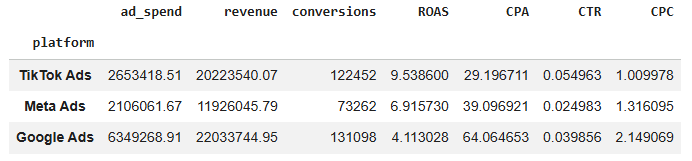
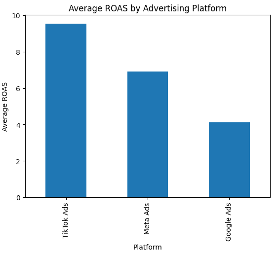
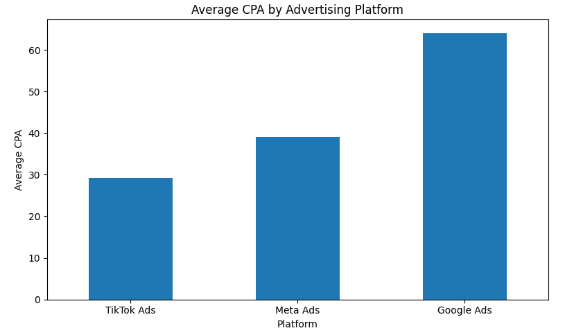
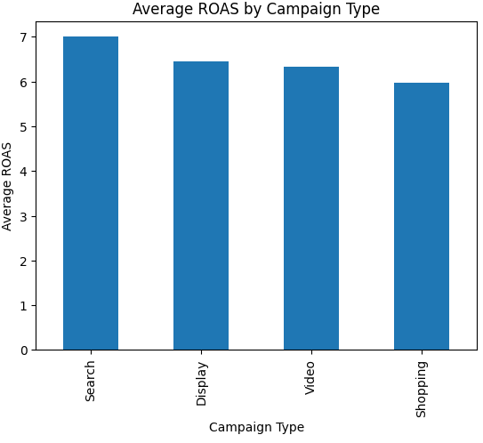
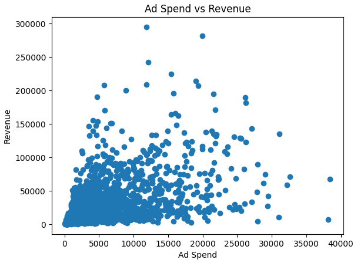
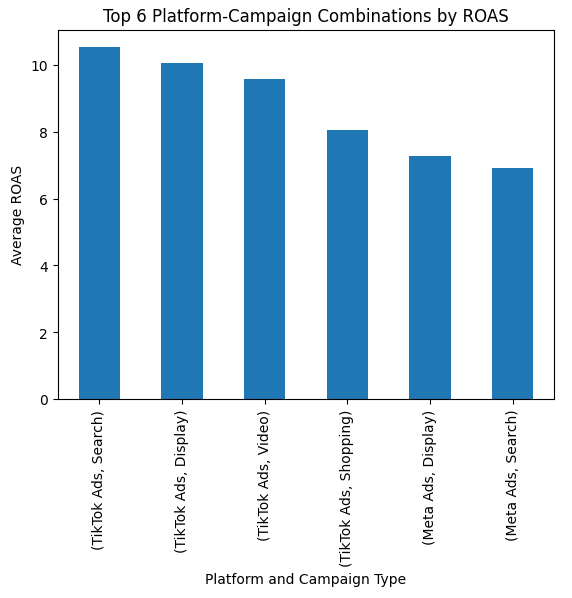

# Advertising Campaign Performance Analysis

This project analyzes a synthetic advertising campaign dataset using Python, Pandas, and Matplotlib in Google Colab.

The dataset includes campaign performance across Google Ads, Meta Ads, and TikTok Ads, with metrics such as impressions, clicks, ad spend, conversions, revenue, ROAS, CPA, CTR, and CPC.

The goal of the project was to compare performance by platform, campaign type, industry, country, and platform-campaign combinations to identify the strongest returns, lowest costs, and most efficient advertising strategies.

## Tools Used

- Python
- Pandas
- Matplotlib
- Google Colab

## Dataset

The project uses the Global Ads Performance dataset from Kaggle, a synthetic dataset created for marketing analytics practice.

The dataset contains campaign-level performance across:

- Google Ads
- Meta Ads
- TikTok Ads

It includes 1,800 rows and 14 columns, with no missing values.

## Metrics Used

- Return on Ad Spend (ROAS)
- Cost Per Acquisition (CPA)
- Click-Through Rate (CTR)
- Cost Per Click (CPC)
- Ad Spend
- Revenue
- Conversions
- Impressions
- Clicks

## Business Questions

- Which advertising platform generated the strongest return on ad spend?
- Which platform generated conversions at the lowest cost?
- Which campaign type had the strongest average ROAS?
- Which industries performed most efficiently?
- Which countries generated the strongest return on ad spend?
- How did ad spend relate to revenue?
- Which platform and campaign-type combinations performed best?

## Analysis

Pandas was used to load, inspect, group, and summarize the advertising dataset.

Performance was analyzed across:

- Advertising platform
- Campaign type
- Industry
- Country
- Platform and campaign-type combinations

For each grouping, the analysis calculated:

- Total ad spend
- Total revenue
- Total conversions
- Average ROAS
- Average CPA
- Average CTR
- Average CPC

Matplotlib was used to create visualizations comparing campaign performance and advertising efficiency.

## Key Visuals

### Platform Performance Summary

Google Ads generated the highest total revenue and conversions, but it also had the lowest average ROAS and highest average CPA. TikTok Ads showed stronger overall efficiency.

### Average ROAS by Platform

TikTok Ads had the highest average ROAS, followed by Meta Ads and Google Ads.

### Average CPA by Platform

TikTok Ads had the lowest average CPA, while Google Ads had the highest.

### Average ROAS by Campaign Type

Search campaigns produced the highest average ROAS, followed by Display, Video, and Shopping campaigns.

### Ad Spend vs Revenue

Higher ad spend was sometimes associated with higher revenue, but the relationship was not consistent across campaigns.

### Top Platform-Campaign Combinations by ROAS

TikTok Search had the highest average ROAS, and TikTok campaigns accounted for four of the top six platform-campaign combinations.

## Key Findings

- TikTok Ads had the highest average ROAS and lowest average CPA, making it the most efficient platform overall.
- Google Ads generated the highest total revenue and conversions, but had the lowest average ROAS and highest average CPA.
- Search campaigns produced the highest average ROAS among campaign types.
- Ad spend showed a generally positive relationship with revenue, but higher spending did not consistently produce the highest returns.
- TikTok Search had the highest average ROAS among platform-campaign combinations, with TikTok occupying four of the top six combinations.

## Files

- `Advertising_Campaign_Performance_Analysis.ipynb` — Google Colab notebook containing the Python analysis, visualizations, and findings
- `global_ads_performance_dataset.csv` — dataset used for the analysis

## Recommendations

## Recommendations

Based on the analysis, future advertising strategy should prioritize TikTok Ads, particularly TikTok Search and Display, due to their stronger ROAS and lower acquisition costs. Google Ads should still be considered when the goal is to generate higher overall revenue and conversion volume, but its efficiency should be monitored. Opportunities for improvement include refining audience targeting, shifting budget toward stronger campaigns, and testing more engaging ad content.
